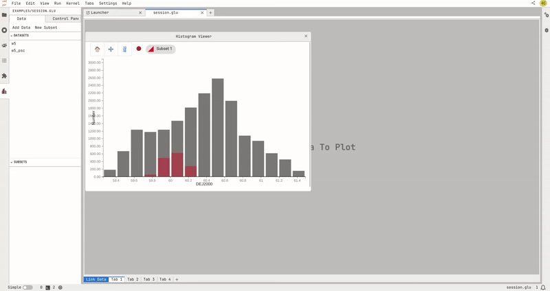

===============
Glue-jupyterlab
===============

glue-jupyterlab allows [Glue](https://glueviz.org/) users to complete the tasks they used Glue Qt for, while giving them access to all JupyterLab features in the same application, "for free". The user experience has been researched in order for users to find the same mechanisms they have in Glue Qt, while removing the friction caused by integrating two user experiences that were initially not designed to be merged. This will bring value to new Glue users from all domains, who have never used the desktop application and who discover Glupyter. It will feel like a JupyterLab experience, with very few new functionalities to learn.
glue-jupyterlab provides intuitive graphical interfaces with data drag-and-drop functionalities, enabling researchers and data analysts to import, visualise, connect and explore multidimensional data.
It also facilitates the creation of appealing plots and charts within the interface, empowering users to gain valuable insights, with capabilities similar as the Glue Qt application.

Installing glue-jupyterlab
==========================

glue-jupyterlab can be installed with ``mamba`` or ``conda``

.. code-block:: bash

   mamba install -c conda-forge glue-jupyterlab

or with ``pip``

.. code-block:: bash

   pip install glue-jupyterlab
